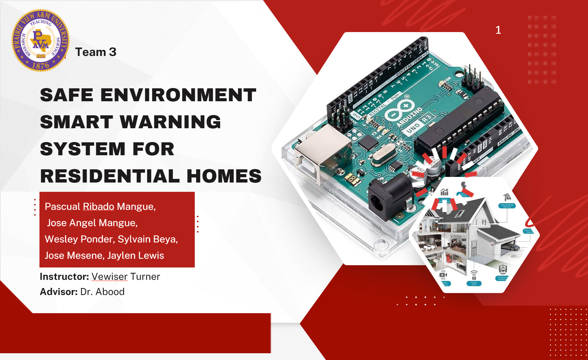

# Safe Environment: Smart Warning System for Residential Homes

A real-time, multi-sensor IoT hazard-detection system that monitors residential homes for gas leaks, high temperature, and unsafe humidity — and pushes instant alerts to a mobile app. Built as a Senior Design Engineering Project (Team 3, Prairie View A&M University, May 2025).

  

> Indoor gas leaks can evade scent detection entirely. U.S. fire departments spend $500M+ annually responding to gas-leak incidents — most involving no actual fire. This system exists to catch the leak before it becomes an emergency.

---

## 🧩 The Problem

- Indoor gas leaks are often odorless/undetectable by scent alone, increasing methane and indoor air pollution risk.
- Between 2003–2018, U.S. fire departments spent ~$500M/year (rising to $564M by 2018) responding to gas leak incidents — the majority with no fire involved.
- Consumer smoke/gas detectors on the market today are largely single-purpose, hard to integrate with smart homes, or expensive.

## ✅ What This System Does

- **Detects** gas leaks, high temperature, and abnormal humidity in real time
- **Alerts locally** via LED + buzzer, and **remotely** via the Blynk mobile app over Wi-Fi
- **Integrates** with existing smart home ecosystems
- **Automatically responds** — triggers a ventilation fan via relay when a hazard is detected

## 🏗️ System Architecture

**Data flow:** DHT11 (temp/humidity) + gas sensor → Arduino Uno (local logic, LCD, buzzer, relay) → Serial link → ESP8266 NodeMCU → Blynk mobile app (remote alerts).

Full wiring schematic: [`hardware/schematic.png`](hardware/schematic.png)

## 🔩 Hardware

| Core Components |
|---|
| Arduino Uno REV3 (main controller) |
| ESP8266 NodeMCU (Wi-Fi + Blynk connectivity) |
| DHT11 temperature/humidity sensor |
| MQ-series gas sensor |
| 2-channel 5V relay → DC brushless cooling fan |
| Buzzer + status LEDs |
| 16x2 LCD display |

Full bill of materials with costs: [`hardware/component-list.md`](hardware/component-list.md)
Prototype build cost: **~$133** (of a $600 budget).

## 💻 Firmware

- [`firmware/arduino_uno/main.ino`](firmware/arduino_uno/main.ino) — sensor reads, LCD display, local alarm, relay control
- [`firmware/esp8266_nodemcu/wifi_module.ino`](firmware/esp8266_nodemcu/wifi_module.ino) — Wi-Fi connectivity, Blynk app integration, secondary gas sensor channel

**To flash:**
1. Copy `firmware/esp8266_nodemcu/config_template.h` → `config.h` and fill in your Wi-Fi + Blynk credentials (git-ignored, so secrets stay local).
2. Flash `main.ino` to the Arduino Uno.
3. Flash `wifi_module.ino` to the ESP8266 NodeMCU.
4. Connect Arduino TX/RX → NodeMCU RX/TX for the serial data bridge.

## 📊 How It Compares

| Product | Price | Multi-Sensor | Smart Home Integration |
|---|---|---|---|
| **This System** | $133 | ✅ Gas + Temp + Humidity | ✅ |
| Shelly Gas LPG | $53 | ❌ Gas only | ✅ |
| X-Sense SC07 | $40 | ❌ Smoke/CO only | ❌ |
| First Alert SMI110 | $25 | ❌ Smoke only | ❌ |

Full competitive breakdown: [`docs/market-analysis.md`](docs/market-analysis.md)

## 📁 Documentation

- [`docs/market-analysis.md`](docs/market-analysis.md) — problem statement, requirements, competitive analysis
- [`docs/design-methodology.md`](docs/design-methodology.md) — build process, timeline, assumptions, constraints
- [`docs/testing-results.md`](docs/testing-results.md) — acceptance criteria, standards compliance, impact analysis

## 📽️ Demo

*Click the image above to watch the full system demo on YouTube.*

> **Next upgrade:** replace this static thumbnail with a short `.gif` of the alarm actually triggering (`media/demo.gif`) — GIFs autoplay on GitHub and are far more effective than a video link for grabbing a recruiter's attention in the first 5 seconds on the page.
---

## 🚧 Known Limitations & Future Work
- No direct first-responder alerting (currently notifies the homeowner only)
- No home-security feature set (motion/entry detection)
- Designed and tested for U.S. residential contexts; not yet validated for global markets
- Next steps: swap the Blynk-only alert path for a fallback SMS/cellular alert in case of Wi-Fi outage during a hazard

## 📜 Standards Referenced

IEEE 1621-2004 · IEEE 1680-2009 · IEEE 802.11 · NFPA 72 · NFPA 70 · ADA 702.1
(Details in [`docs/testing-results.md`](docs/testing-results.md))

## 📄 License

MIT — see [LICENSE](LICENSE)

---

*Built as a capstone engineering project at Prairie View A&M University.*
